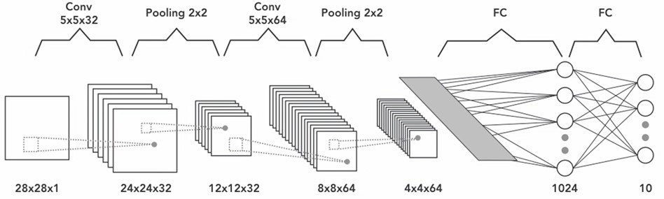

# Project-on-Convolutional-Neural-Network
This project consists of 2 ipynb files. 

In first file, a simple deep Neural network is build to predict the MNIST dataset.
In this we have 2 hidden layers with 512 neurons having relu as activation function each.
An o/p layer with 10 neurons (for each class of numbers from 0 to 9) with softmax activation function.
Model was compiled with Adam optimizer and categorical_crossentropy for loss calc. The model gave an accuracy of 97.8%.

In second file I have build a CNN model for prediction of MNIST dataset.
Below is the architecture used to build CNN model.

kernel of 5 * 5 is used in convolutional layers. To maintain the spactial size of the image MaxPooling is used afterboth the convolving layers.
Flatten is done before a Dense and o/p layer.
This CNN model gives us the accuracy of 99.3% for MNIST dataset.

